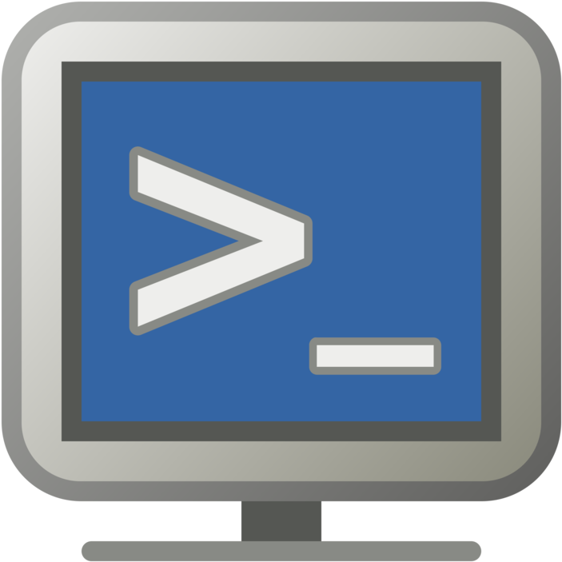

##### 
  

------

### Cisco SD-WAN Sandbox v1.1 

This is a Cisco SD-WAN (Viptela) sandbox environment built as a collection of vagrant files and scripts to automate the deployment of the topology below. 

### Accessing the Sandbox
---

``
Note: The sandbox is accessible via a secure tunnel. You will need to use the Cisco AnyConnect VPN client to establish a connection to the sandbox environment.
``

- Create a DevNet account if you don't already have one. You can sign up for free at [https://developer.cisco.com](https://developer.cisco.com).

- Reserve a sandbox at [https://devnetsandbox.cisco.com](https://devnetsandbox.cisco.com) by searching for "sd-wan" and clicking on the "Reserve" button for the "Cisco SD-WAN (Viptela) Sandbox v1.1" sandbox.

### Cisco Modeling Labs (CML2) Access & Navigation
---

Once connected to the sandbox via VPN, you can access the CML2 server at the following URL: 

[Cisco Modeling Labs](https://10.10.20.161/) 

You will be prompted to login and be able to perform the following tasks:

-  Create Network Topologies & Labs
-  Access the Lab Devices via Console
-  Model, Configure, & Test Network Topologies & Labs
-  Save & Restore Network Topologies & Labs

### Lab Components: SD-WAN Topology
---

- vManage:  is the centralized network management system for Cisco SD-WAN. It provides a GUI dashboard to monitor, configure, and maintain multiple vEdge routers deployed in a secure extensible network.

    

- vBond: 
 is the orchestrator and single point of contact into the overlay network. It is responsible for authentication, authorization, and bringing up secure tunnels between the various components in the overlay network.

    

- vSmart:  is the brain of the Cisco SD-WAN solution. It is responsible for building and advertising the global view of all sites to all the SD-WAN routers in the overlay network. It also runs the routing protocol between the SD-WAN routers to build the overlay network.

    

- vEdge Cloud:  is a virtualized version of the vEdge router that is compatible with KVM, VMware ESXi, Microsoft Hyper-V, and Oracle VirtualBox hypervisors. It is a full-featured, low-footprint, x86-based router that supports hosting of multiple virtualized network functions (VNFs) in a single platform.

    

- DevBox (Ubuntu 16.04):  is a Linux-based virtual machine that is used to host the vManage, vBond, and vSmart controllers. It is also used to host the vEdge Cloud router.

---

### More Resources
---

- [Cisco SD-WAN DevNet Learning Labs](https://developer.cisco.com/learning/modules/sd-wan)

- [Video: Cisco SD-WAN DevNet Sandbox](https://developer.cisco.com/sdwan/video/)

- [Cisco SD-WAN DevNet Sandbox](https://devnetsandbox.cisco.com/RM/Diagram/Index/0e3a3e7a-0a7a-4b0e-8b0a-8b0a8b0a8b0a)

<table center>
  <thead allign=center>
    <tr>
      <th align=center > </th>
      <th align=center></th>
      <th align=center>  </th>
      <th align=center> </th>
    </tr>
  </thead>
  <tbody >
    <tr>
      <td>
        
      </td>
      <td>
        
      </td>
      <td>
        
      </td>
      <td>
        
      </td>
  

  </tbody>
</table>
