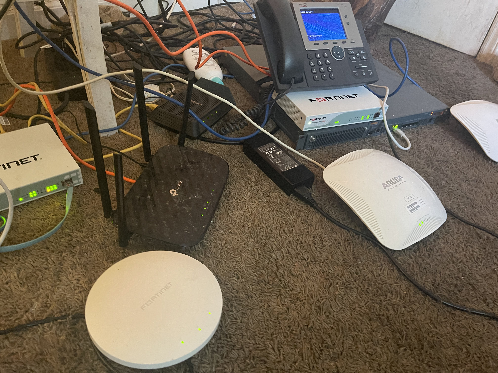
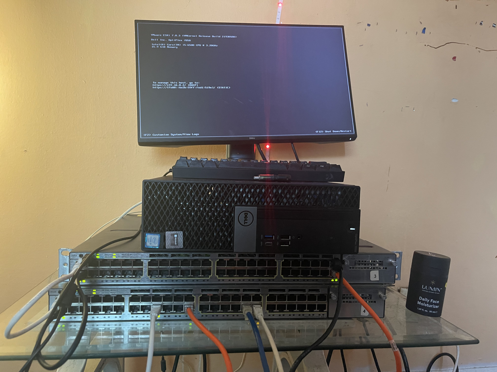
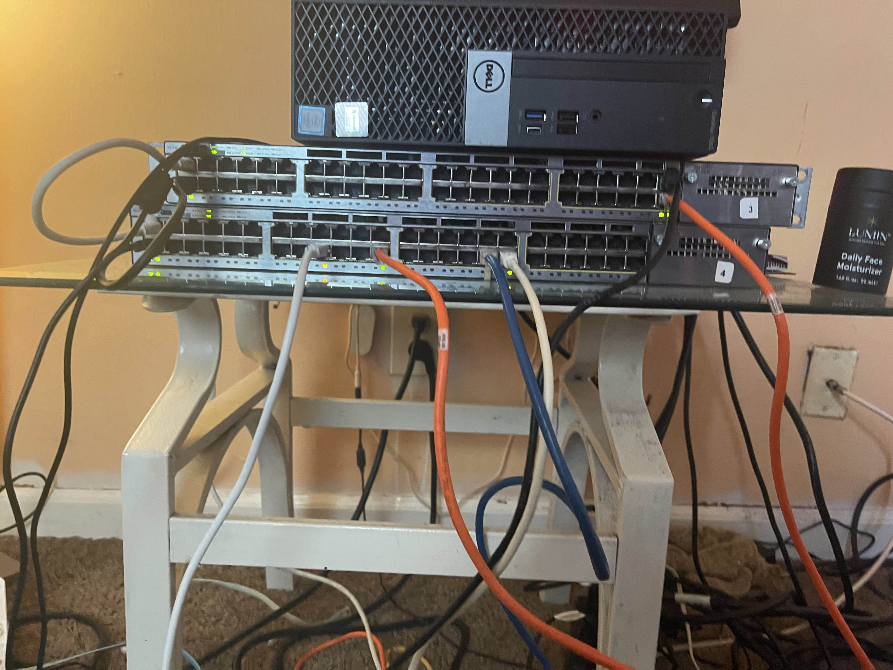
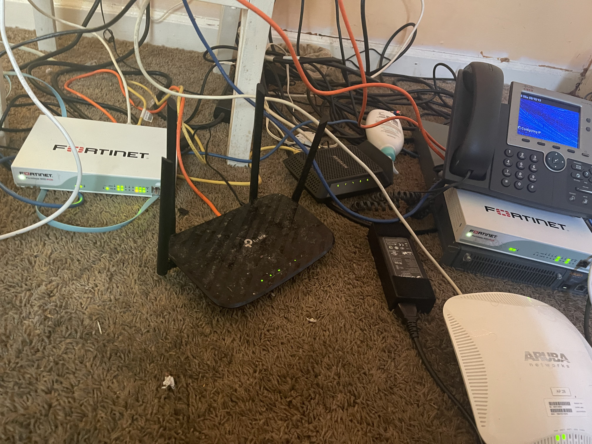
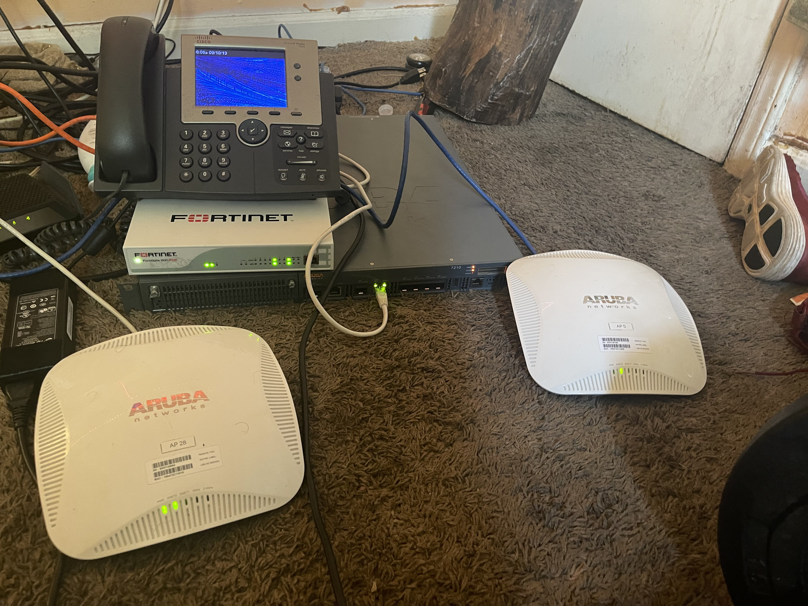
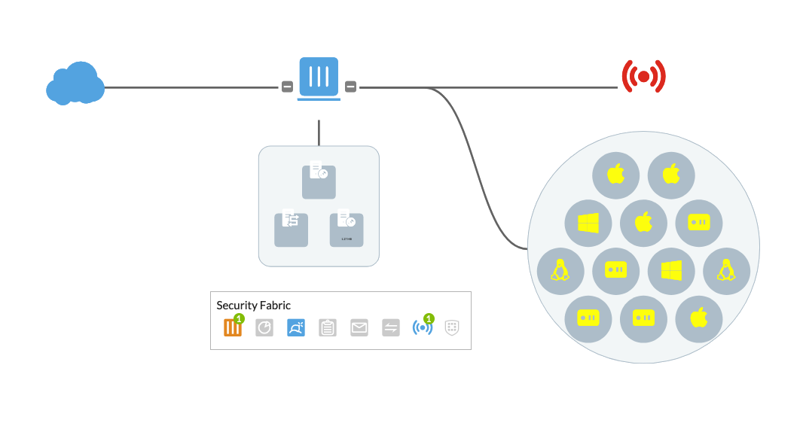
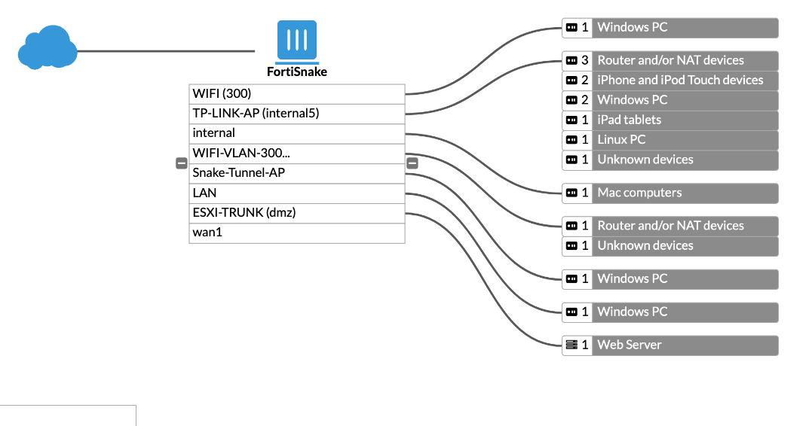

### <p align="center">  </p>
---

```
In Research Methodology, we will be discussing the process of how we will be implementing our SD-WAN Lab. We will be discussing the advantages and disadvantages of a physical lab, and the advantages and disadvantages of a virtual lab. We will also be discussing the equipment that we will be using in our physical lab, and the topology of our physical lab. We will also be discussing the goal typology of our physical lab.
```

---

### <p align="center">  </p>

---

```
SD-WAN is a flexable technology that can be implemented in many different ways. In this section, we will be discussing the advantages and disadvantages of a physical lab, and the advantages and disadvantages of a virtual lab. We will also be discussing the equipment that we will be using in our physical lab, and the topology of our physical lab. We will also be discussing the goal typology of our physical lab.
```


 |  | 
| --- | --- | --- |

---
### <p align="center">  </p>

---

|  |  |
| --- | --- |
| Physical labs are more reliable than virtual labs. | Physical labs are more expensive than virtual labs. |
| Physical labs are more secure than virtual labs. | Physical labs are more difficult to maintain than virtual labs. |
| Physical labs are more scalable than virtual labs. | Physical labs are more difficult to troubleshoot than virtual labs. |
| Physical labs are more cost effective than virtual labs. | Physical labs are more difficult to upgrade than virtual labs. |
| Physical labs are more flexible than virtual labs. | Physical labs are more difficult to configure than virtual labs. |


---
### <p align="center">  </p>
---

- [x] 1x Azure Subscription
- [x] 2x Fortigate 60D-POE Firewalls
- [x] 2x Cisco Catalyst 2960 Switch
- [x] 1x FortiAP Wireless Access Point
- [x] Aruba Wireless Controller
- [x] 4x Aruba Wireless Access Points (AP-205)
- [x] 1x Computer with ESXi 6.7 Installed
- [x] Netgear Docsis 3.0 Modem (WAN Connection)

---

---
### <p align="center">  </p>
---

<div style="display:flex">
     <div style="flex:1;padding-right:10px;">
          
     </div>
     <div style="flex:1;padding-left:10px;">
          
     </div>
     <div style="flex:1;padding-left:10px;">
          
     </div>
</div>
<p align="center">
  
&nbsp; &nbsp; &nbsp; &nbsp;
  
</p>

---


---
### <p align="center">  </p>
---


<div style="display:flex">
     <div style="flex:1;padding-right:10px;">
          
     </div>
     <div style="flex:1;padding-left:10px;">
          
     </div>
     <div style="flex:1;padding-left:10px;">
          
     </div>
</div>

---

### <p align="center">  </p>


<p align="center">
  
  </p>


---


---
### Murtadha Marzouq


