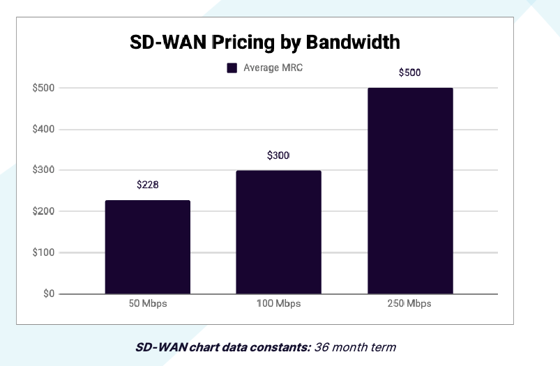

##### <p align="center">  </p>
------
### <p align="center">  </p>
---
```
SD-WAN is an acronym for Software-Defined Wide Area Network. It is a virtual WAN architecture that allows enterprises to leverage any combination of transport services – including MPLS, LTE and broadband internet services – to securely connect users to applications. SD-WAN uses a centralized control function to securely and intelligently direct traffic across the WAN. This increases application performance and delivers a high quality user experience, resulting in increased business productivity, agility and reduced costs for IT. 
```
---
### <p align="center">  </p>
---

<p align="center">  </p>

    - Cost Savings
    - Increased Agility
    - Improved Application Performance
    - Increased Security
    - Improved Visibility & Control

<p align="center">  </p>

    - Security Concerns
    - Complexity
    - Lack of Standardization

```
SD-WAN is a relatively new technology, and as such, it is still evolving. There are many advantages to SD-WAN, but there are also some disadvantages. 
```
---

### <p align="center">  </p>
---
```
SD-WAN architecture is comprised of two key components: the SD-WAN edge and the SD-WAN orchestrator. The SD-WAN edge is the device that sits at the edge of a network, connecting the network to multiple WAN links. The SD-WAN edge is responsible for securely forwarding traffic to and from the WAN. The SD-WAN orchestrator is the centralized management and control component of SD-WAN architecture. The orchestrator is responsible for the configuration, monitoring and management of the SD-WAN edge devices. 
```
A typical SD-WAN architecture consists of the following components such as Customer Premises Equipment (CPE), SD-WAN Edge, SD-WAN Orchestrator, and SD-WAN Controller.

<p align="center">  </p>


#### <p align="center"> **Source**: [SDxCentral](https://www.sdxcentral.com/networking/sd-wan/definitions/software-defined-sdn-wan/sd-wan-vendors-overview/cisco-sd-wan/) </p>
---

For example, in the case of Fortinet’s Secure SD-WAN solution, the SD-WAN edge is the FortiGate Next-Generation Firewall (NGFW) and the SD-WAN orchestrator is FortiManager.

---

<p align="center">  </p>

#### <p align="center"> **Source**: [Fortinet](https://www.fortinet.com/resources/cyberglossary/sd-wan.html) </p>

---
### <p align="center">  </p>
---


##### <p align="center">  </p>
#### <p align="center"> **Source**: [LightYear](https://assets.ctfassets.net/wivd9zt8fi3t/5GWNpMjO5hoF24fO9oZzHQ/725e16a6e17912211495a2e795126bd3/Wide_Area_Networking_Pricing_Guide_vF.pdf)
---
```
SD-WAN is a relatively new technology, and as such, it is still evolving. There are many advantages to SD-WAN, but there are also some disadvantages. 
```
### <p align="center">  </p>

- Fragmented landscape with less certainty on performance metrics vs MPLS/P2P
- Not as capable as MPLS in some centralized hub and spoke environments
- Technically public network in many cases, which raises security concerns for some customer profiles
- Despite the power of SD-WAN, underlying quality circuits still matter


---
### Murtadha Marzouq


### Sources:
- https://www.fortinet.com/resources/cyberglossary/sd-wan.html
- https://www.sdxcentral.com/sd-wan/definitions/what-is-sd-wan/
- https://assets.ctfassets.net/wivd9zt8fi3t/5GWNpMjO5hoF24fO9oZzHQ/725e16a6e17912211495a2e795126bd3/Wide_Area_Networking_Pricing_Guide_vF.pdf
------


