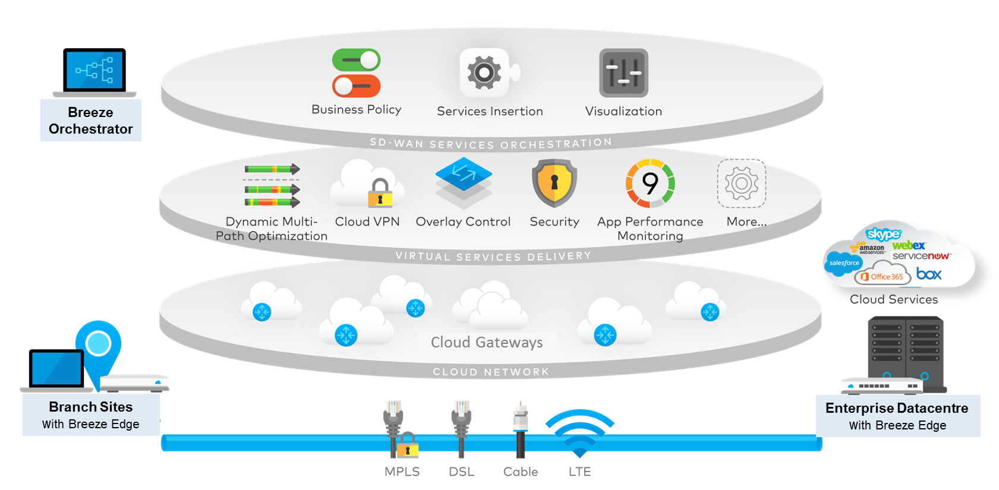

##### 
  

---

### Table of Contents

- [Introduction](#introduction)
    - [Problem Statement](#problem-statement)
    - [Problem Description](#problem-description)
- [Solution](#solution)
    - [Links to Resources](#links-to-resources)
- [Conclusion](#conclusion)
    - [References](#references)
    - [Author](#author)

### Introduction

Because of its capacity to route across several provider networks and give network visibility, SD-WAN is a formidable alternative to existing WAN solutions. It might be the solution to your networking prayers, but appropriate SD-WAN design and deployment is subtle and sophisticated. This is why we are here to help you understand the technology and how to implement it in your network.

### Problem Statement 

``SD-WAN is not a well known technology in the research community because of the lack of resources and the high cost of implementation.``

- **SD-WAN**: Cost of Implementation
- **SD-WAN**: High Skill Requirements for Implementation
- **SD-WAN**: Lack of Resources for Research and Development

### Problem Description
- SD-WAN implementation skill barrier is high.

   
   To benefit from SD-WAN, the researcher must have a good understanding of the technology and how to implement it as well as having access to enterprise-grade equipment from vendors such as Cisco, Fortinet, and others.
Cisco Example Topology:

Source : <a href="https://www.cisco.com/c/en/us/td/docs/solutions/Verticals/EE/DG/ee-WAN-dg.pdf">Cisco SD-WAN</a>

Fortinet Example Topology:

Source : <a href="https://docs.fortinet.com/document/fortigate/6.4.0/sd-branch-retail-playbook/942638/sd-wan-orchestration">Fortinet SD-WAN</a>

- [ ] WAN Links are expensive and having multiple links is a costly solution for researchers.

    To test SD-WAN, the researcher must have multiple WAN links to test the failover and load balancing features of SD-WAN. This is not a feasible solution for researchers because of the high cost of WAN links.

### Solution

- [ ] Sandbox environment for SD-WAN.

    Vendors such as Cisco and Fortinet provide a sandbox environment for researchers to test their products. However, the sandbox environment is limited to a few hours of testing and the researcher must have a good understanding of the technology to be able to test it in the sandbox environment. The way to solve this problem is to create a sandbox environment for SD-WAN that is accessible to researchers and students to test their SD-WAN solutions.

### Links to Resources:

<a href="https://devnetsandbox.cisco.com/RM/Diagram/Index/0e7b8c9e-7b0b-4b1a-8d0e-0d9b0f0d6e2a?diagramType=Topology">
Link to Cisco Sandbox</a>

<a href="https://azuremarketplace.microsoft.com/en-us/marketplace/apps/fortinet.fortinet-fortigate?tab=Overview">
Fortinet Azure Test Drive</a>

### Conclusion

SD-WAN is the future of networking and it is a technology that is worth researching and implementing. However, the lack of resources and the high cost of implementation is a barrier for researchers and students to learn and implement SD-WAN. This is why we are here to help you understand the technology and how to implement it in your network.

### References

<a href="https://www.cisco.com/c/en/us/td/docs/solutions/Verticals/EE/DG/ee-WAN-dg.pdf">Cisco SD-WAN</a>

<a href="https://docs.fortinet.com/document/fortigate/6.4.0/sd-branch-retail-playbook/942638/sd-wan-orchestration">Fortinet SD-WAN</a>

<a href="https://www.cisco.com/c/en/us/products/collateral/routers/4000-series-integrated-services-routers-isr/white-paper-c11-740775.html">Cisco SD-WAN White Paper</a>

<a href="https://www.cisco.com/c/en/us/solutions/collateral/enterprise-networks/sd-wan/white-paper-c11-741490.html">Cisco SD-WAN White Paper</a>

<a href="https://assets.ctfassets.net/wivd9zt8fi3t/5GWNpMjO5hoF24fO9oZzHQ/725e16a6e17912211495a2e795126bd3/Wide_Area_Networking_Pricing_Guide_vF.pdf">
WAN Pricing Guide</a>

<a href="https://query.prod.cms.rt.microsoft.com/cms/api/am/binary/RW16Rzh">
Fortigate Test Drive Manual</a>

---

<table center>
  <thead allign=center>
    <tr>
      <th align=center > </th>
      <th align=center></th>
      <th align=center>  </th>
      <th align=center> </th>
    </tr>
  </thead>
  <tbody >
    <tr>
      <td>
        
      </td>
      <td>
        
      </td>
      <td>
        
      </td>
      <td>
        
      </td>
  

  </tbody>
</table>
